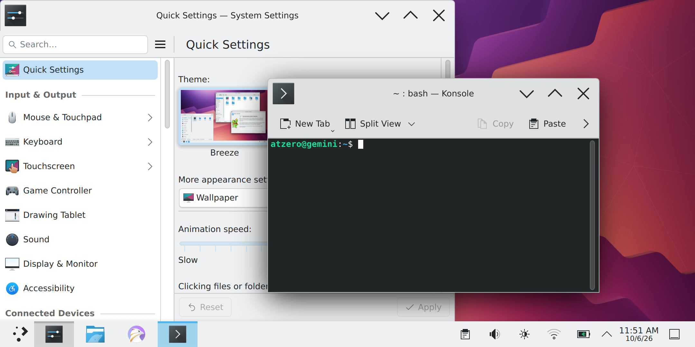
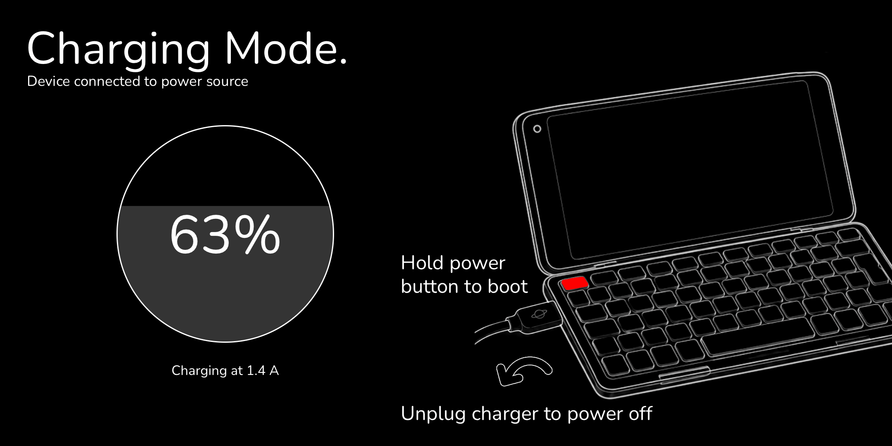

# gemini-debian

Debian 13 (trixie) with KDE Plasma for the Planet Gemini PDA (MT6797X), built on Hydra and
flashed to the `userdata` partition, replacing NixOS.

This repo builds only the Debian root filesystem. The kernel, device tree
and boot image come from
[atzandrew/gemini-nixos](https://github.com/atzandrew/gemini-nixos) (a fork
of cjdell's project), checked out next to this repo as `../gemini-nixos`
(`GEMINI_NIXOS_DIR` in `config.env`). Flash its boot image first; the rootfs
must match its kernel version (`EXPECT_KVER`).

> **AI-generated work.** Most of this repo, and most of the gemini-nixos fork
> changes listed below (kernel rebase, driver fixes, build scripts, docs), was
> written by Claude (Anthropic's AI coding agent), directed and tested on a real device by a
> human. Treat it accordingly: read the code before you trust it, expect
> mistakes, and flash at your own risk.



## Road to the first beta image

**Beta readiness: 58 %** (11 of 19 checklist items done, as of 2026-10-07)

```
████████████░░░░░░░░  58 %
```

Since 2026-10-06 three items were added to the list and done: CPU clock
scaling, the temperature sensor with throttling, and tear-free display. The
remaining eight are about turning the working device into an image other
people can install. The image on our own Gemini is still a hand-updated one;
the first item below rebuilds it purely from the repos.

The goal of the beta is a downloadable image that someone other than us can
flash safely and set up for themselves.

### Done

- [x] **Kernel 6.6.157 + boot image** with a quiet boot and a custom boot logo
- [x] **KDE Plasma 6 on Wayland** with GPU acceleration, touch, rotation and scaling
- [x] **Wi-Fi, Bluetooth and sound**
- [x] **Accurate battery gauge** and low-battery protection
- [x] **Real power off**: a switched-off Gemini no longer drains its battery
- [x] **Charging screen** when a charger is plugged into a switched-off Gemini
- [x] **Faster charging** (2.5 A input instead of 500 mA)
- [x] **Correct clock at boot** and a **power menu on a long press of Esc/On**
- [x] **Automatic CPU clocks** on all ten cores, including the two fast A72
      cores, which are now online two seconds into boot
- [x] **Temperature sensor and overheat protection**: throttles at 85 °C,
      shuts down safely at 105 °C
- [x] **Tear-free display**, synced to the panel's real refresh

### Still to do before the beta

- [ ] **Clean build and test**: an image built purely from the repos (current
      kernel modules, display driver and battery-guard included), flashed from
      scratch, plus an overnight power-off test on battery
      ([docs/beta-test.md](docs/beta-test.md); `sudo gemini-beta-check` on the
      device)
- [ ] **Each unit's own Wi-Fi identity**: read the Wi-Fi calibration (NVRAM)
      record and MAC address from the device instead of shipping one unit's copy
      (in the image since 2026-10-08: `gemini-wifi-nvram`; on-device test pending)
- [ ] **First-boot setup**: create your own user and password, pick a desktop,
      keyboard layout and Wi-Fi network (no built-in account)
- [ ] **Wi-Fi fixes in the image**: WPA2/WPA3 mixed networks, and connecting
      before login (in the image since 2026-10-08; on-device test pending)
- [ ] **Storage speed decision**: the faster eMMC mode (HS200, about 3× faster)
      has passed every test so far and runs in every current boot image; decide
      after a few more cold boots whether to ship it or the proven slower one
- [ ] **Install guide**: mandatory full backup (including NVRAM), partition
      layout check, flashing steps
- [ ] **Release packaging**: compressed image, boot image and checksums on
      GitHub Releases
- [ ] **Licence notices** for firmware, fonts and artwork

## Features

### Desktop

- **KDE Plasma 6 (Wayland)** as the default desktop, with labwc as a lighter
  alternative, behind the **SDDM** login screen (Wayland, rotated and scaled
  like the desktop). Plasma runs at about 60 frames per second, **without tearing**:
  frames are synced to the panel's 59 Hz refresh.
- **GPU acceleration** on the Mali-T880 (panfrost, OpenGL ES 3.1).
- **Touchscreen and rotation** set up for the landscape keyboard position,
  scaled 2× for the 5.99" 2160×1080 panel.
- **Keyboard** with the Gemini's US and UK layouts and working brightness keys.
- **Long press of Esc/On** opens the power menu (shut down, restart, log out).
- **Screen off turns the backlight fully off.**
- **Everyday apps**: Firefox, Dolphin, Konsole, Gwenview (images), Ark
  (archives: zip, 7z, rar, tar), KWrite (text), Okular (PDF), KCalc, Haruna
  (video/music), Spectacle (screenshots), System Monitor.

### Battery and power

- **Real battery percentage** from the MT6351 PMIC's coulomb counter: charge
  in and out is counted, not guessed from voltage. Shows charge rate, time to
  full or empty, and learns the battery's real capacity over time.
- **Low-battery protection**: desktop warnings, then a safe shutdown before
  the battery is damaged.
- **Real power off**: switched off, the Gemini stays off and keeps its charge.
- **Faster charging**: the charger's input limit is raised from 500 mA to 2.5 A
  (about 1.5 A into the battery while using Plasma).
- **Correct time at boot** from the PMIC's real-time clock, before the network
  is up.
- **CPU frequency scaling** on all three clusters (4× A53 up to 1.1 GHz, 4× A53
  up to 1.35 GHz, 2× A72 up to 1.5 GHz), so the CPUs slow down when idle and
  speed up under load.
- **Temperature monitoring and protection**: the SoC's own sensor drives
  throttling at 85 °C and a safe shutdown at 105 °C.

### Charging screen

Plug a charger into a switched-off Gemini and it shows the battery level
instead of booting the whole system:



- The circle fills with the charge level and turns red below 15 %. The line
  under it shows what is happening: charging current, "Charged" or "Fully
  charged", or a warning when the battery is very low.
- **Hold Esc/On** to boot into Debian; **unplug** the charger to switch off.
- The screen turns itself off after 15 seconds; any key turns it back on.
- No Linux boot text before it. Normal power-ons still show the boot messages.

### Hardware

- **Wi-Fi** (MT6630) with NetworkManager, and **Bluetooth**, including
  Bluetooth LE mice and keyboards. Each Gemini uses its **own Wi-Fi MAC
  address and factory radio calibration**, read from its Android `nvdata`
  partition at boot (never shipped in the image). Networks added in Plasma
  connect at boot, before login; WPA2/WPA3 mixed networks are joined as WPA2.
- **Faster storage**: eMMC in HS200 mode (about 150 MB/s read, 100 MB/s write).
- **FUSE** for sshfs, AppImages and the desktop's file portal.
- **Sound** through the speaker and the headphone jack (switch with
  `sudo gemini-audio speaker|headphone|toggle`).
- **USB network link** for development (`10.15.19.82`).
- **Updates without reflashing** a running Gemini ([docs/updating.md](docs/updating.md)).

### Known limitations

- No suspend or deep idle yet, so the battery drains at about 550 mA with the
  screen off. Most of that is the chip never reaching a low-power state; the
  power-management firmware that fixes it is found but not ported yet.
- CPU and GPU clocks are still below stock (A72s 1.5 of about 2.5 GHz, GPU fixed
  at 500 MHz). Under sustained full load the chip reaches 85 °C within a minute
  and throttles.
- WPA3-only Wi-Fi networks don't work (the driver can't do WPA3); mixed
  WPA2/WPA3 networks are joined as WPA2 automatically.
- Headphone plug-in detection isn't automatic yet.
- The screen stays powered when "off" (only the backlight switches off).

## Changes in the gemini-nixos fork

What [atzandrew/gemini-nixos](https://github.com/atzandrew/gemini-nixos) adds
on top of cjdell's work (kernel source changes live in
[`devices/planet-geminipda/kernel/delta/`](https://github.com/atzandrew/gemini-nixos/tree/main/devices/planet-geminipda/kernel/delta)):

- **Kernel 6.6 → 6.6.157 stable rebase**
  ([567ed73](https://github.com/atzandrew/gemini-nixos/commit/567ed73)); config adds exFAT + NLS_UTF8
  ([d343495](https://github.com/atzandrew/gemini-nixos/commit/d343495)).
- **Display:** the scanout driver
  [`geminipda-drm.c`](https://github.com/atzandrew/gemini-nixos/blob/main/devices/planet-geminipda/kernel/delta/drivers/gpu/drm/tiny/geminipda-drm.c)
  copies each frame in a single pass and syncs the CPU cache only for the damaged area
  ([e90dd06](https://github.com/atzandrew/gemini-nixos/commit/e90dd06)), with a software vblank at `refresh_hz`, default 60
  ([064cda8](https://github.com/atzandrew/gemini-nixos/commit/064cda8)).
  Since 2026-10-07 it uses the display engine's real frame interrupt as vblank
  and starts each copy at the start of the panel's blanking period, which
  removes tearing ("vsync1"; [docs/display.md](https://github.com/atzandrew/gemini-nixos/blob/main/docs/display.md)).
  Screen off also switches the backlight off.
- **CPU clocks:** frequency scaling for all three MT6797 clusters with mainline
  `mediatek-cpufreq` (new clock and SRAM-regulator drivers,
  [2f20db6](https://github.com/atzandrew/gemini-nixos/commit/2f20db6)); the A72
  cluster is powered on by the kernel at boot
  ([c028f86](https://github.com/atzandrew/gemini-nixos/commit/c028f86)) and clocked
  through the firmware's frequency call
  ([929fd27](https://github.com/atzandrew/gemini-nixos/commit/929fd27)).
  Details: [docs/cpu-dvfs.md](https://github.com/atzandrew/gemini-nixos/blob/main/docs/cpu-dvfs.md).
- **Thermal:** the MT6797 SoC temperature sensor with factory calibration,
  cooling maps and trip points
  ([6225e23](https://github.com/atzandrew/gemini-nixos/commit/6225e23);
  [docs/thermal.md](https://github.com/atzandrew/gemini-nixos/blob/main/docs/thermal.md)).
- **Audio:** the mt6797 AFE again registers its sub-DAI widgets and routes
  ([f4c9f84](https://github.com/atzandrew/gemini-nixos/commit/f4c9f84)).
- **Keyboard:** `matrix_keypad` polls at a runtime `poll_ms` (default 20 ms)
  instead of fast device-tree polling ([0f076a2](https://github.com/atzandrew/gemini-nixos/commit/0f076a2),
  [6488c32](https://github.com/atzandrew/gemini-nixos/commit/6488c32)); zram built in.
- **Battery:** an MT6351 fuel-gauge driver (coulomb counter, capacity
  learning) and a gauge-aware battery guard.
- **Power:** a real power off (the PMIC power-down now runs while interrupts
  are still on), an MT6351 real-time clock driver, and Esc/On long press as the
  power key.
- **Charging screen:** the initrd recognises the bootloader's off-mode-charging
  boot and shows a battery screen (`devices/planet-geminipda/charger.sh`,
  `charger-ui/`). The kernel stays quiet until that decision.
- **eMMC HS200** at 192 MHz for the MT6797
  ([196af1d](https://github.com/atzandrew/gemini-nixos/commit/196af1d); final soak pending).
- **Config:** FUSE ([4645cba](https://github.com/atzandrew/gemini-nixos/commit/4645cba))
  and UHID/HIDRAW/UINPUT for Bluetooth LE input devices
  ([01425eb](https://github.com/atzandrew/gemini-nixos/commit/01425eb)).
- **Groundwork before the rebase** ([6724b54](https://github.com/atzandrew/gemini-nixos/commit/6724b54)): charger driver,
  device tree, initrd and greeter changes.

## Credit

This port stands on [cjdell/gemini-nixos](https://github.com/cjdell/gemini-nixos):
the mainline kernel bring-up, device tree, drivers, and most of the device
scripts and hardware research reused here (each copied file names its
gemini-nixos source). Thank you!

The temperature sensor driver and the display pipeline notes build on
[ixoo/gemini-pda-mainline](https://github.com/ixoo/gemini-pda-mainline)'s
careful MT6797 research. Vendor behaviour was checked against Gemian's
[gemini-linux-kernel-3.18](https://github.com/gemian/gemini-linux-kernel-3.18).

The charging screen uses the [Nunito](https://github.com/googlefonts/nunito)
font (SIL Open Font License 1.1) and [stb](https://github.com/nothings/stb)
(public domain).

## Docs

- **Plan and status:** [docs/plan.md](docs/plan.md)
- **Build + flash + first boot:** [docs/flashing.md](docs/flashing.md)
- **Update a running Gemini (no reflash):** [docs/updating.md](docs/updating.md)
- **Clean-flash beta test:** [docs/beta-test.md](docs/beta-test.md)

## Layout

| Path | What |
|---|---|
| `config.env` | user, hostname, timezone, locale, Debian suite, expected kernel |
| `packages/base.list`, `packages/extra.list`, `packages/desktop.list` | Debian packages in the image (extra = also shipped in the update bundle) |
| `overlay/` | files copied as-is into the rootfs (owned by root) |
| `bin/build-rootfs.sh` | entry point (run on Hydra as your user) |
| `bin/in-container.sh` | mmdebstrap + ext4 packing, inside a debian:trixie podman container |
| `bin/customize.sh` | modules/firmware, user, locale, services, boot-handoff checks |
| `docs/beta-test.md` | clean-flash test: drift checks, Wi-Fi, eMMC cold boots, overnight power-off |
| `screenshots/` | images used in this README |
| `build/`, `out/` | scratch and output (git-ignored) |

## Build

```sh
cd ~/Build/gemini-debian
bash bin/build-rootfs.sh        # -> out/gemini-debian-rootfs.img
```

Needs: `nix` (to build gemini-nixos for modules/firmware), `podman`,
`openssl`, sudo for podman. Internet access for deb.debian.org.
